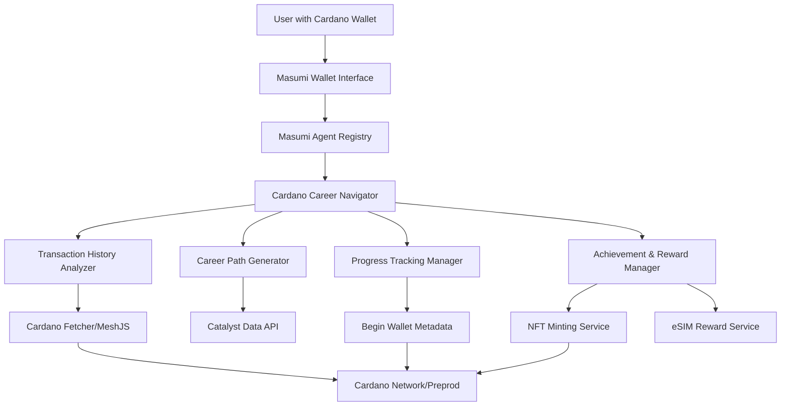
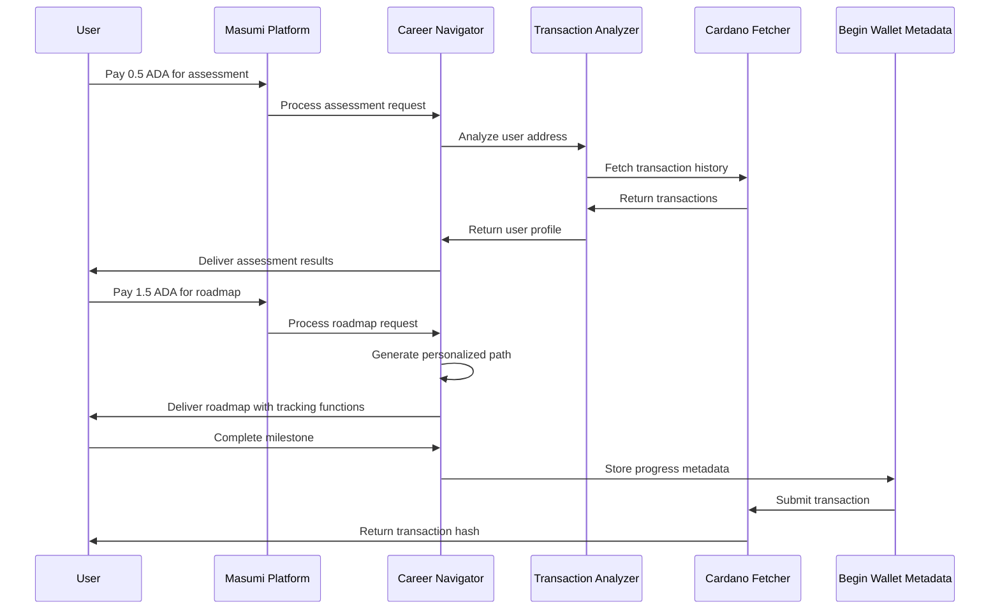

# Design Document

## Overview

The Cardano Career Navigator is a Masumi AI agent that provides personalized career guidance for the Cardano ecosystem. The system analyzes users' on-chain transaction history to create tailored learning paths, integrates with Begin Wallet's unique features for progress tracking and rewards, and monetizes through ADA payments via the Masumi platform.

### Key Design Principles

1. **Cardano-Specific Focus**: Unlike generic Web3 career advice, all recommendations are tailored to the Cardano ecosystem
2. **On-Chain Verification**: Progress tracking uses Begin Wallet's metadata standard (label 100) for verifiable achievements
3. **Real-World Utility**: Integration with Begin Wallet's eSIM feature provides tangible rewards
4. **Incremental Monetization**: Three-tier pricing model (0.5, 1.5, 3.0 ADA) for different service levels
5. **Hackathon-Ready**: Designed for rapid implementation with clear MVP boundaries

## Architecture

### High-Level System Architecture



### Component Interaction Flow



## Components and Interfaces

### 1. Masumi Agent Core (`agent.js`)

**Purpose**: Main entry point and orchestrator for all Career Navigator functionality

**Key Interfaces**:
```javascript
class CareerNavigatorAgent {
  // Agent registration and initialization
  async register()
  
  // Main request handler
  async processRequest(request: {
    type: 'assessment' | 'roadmap' | 'catalyst',
    userAddress: string,
    timeline?: string
  })
  
  // Service-specific handlers
  async handleAssessment(request)
  async handleRoadmap(request)
  async handleCatalystGuidance(request)
}
```

**Dependencies**:
- `masumi-sdk`: Agent registration and payment processing
- `@meshsdk/core`: Cardano blockchain interaction
- `axios`: External API calls

### 2. Transaction History Analyzer (`analyzer.js`)

**Purpose**: Analyzes user's on-chain activity to determine skills, experience, and interests

**Key Functions**:
```javascript
class TransactionAnalyzer {
  async analyzeUserBackground(userAddress: string): Promise<UserProfile>
  
  // Analysis helpers
  determineExperienceLevel(transactions): 'beginner' | 'intermediate' | 'advanced'
  extractTechnicalSkills(transactions): string[]
  extractInterests(transactions): string[]
  determineLearningStyle(transactions): string
  determinePreferredPath(transactions): string
}

interface UserProfile {
  experienceLevel: string;
  technicalSkills: string[];
  interests: string[];
  learningStyle: string;
  preferredPath: string;
}
```

**Analysis Logic**:
- **Experience Level**: Based on transaction count and complexity
  - Beginner: < 5 transactions
  - Intermediate: 5-20 transactions
  - Advanced: > 20 transactions
- **Technical Skills**: Extracted from asset interactions
  - NFT interactions → "nft" skill
  - DeFi protocols → "defi", specific protocol skills
  - Governance participation → "governance", "drep"
  - Begin Wallet patterns → "dapp-discovery"
- **Interests**: Derived from transaction patterns
  - eSIM assets → "travel", "real-world-utility"
  - Staking patterns → "staking", "passive-income"

### 3. Career Path Generator (`pathGenerator.js`)

**Purpose**: Creates personalized learning roadmaps based on user profiles

**Key Functions**:
```javascript
class CareerPathGenerator {
  async generateCareerPath(profile: UserProfile, timeline: string): Promise<CareerRoadmap>
  
  // Path generation helpers
  generateLearningPath(path: string, level: string, timeline: string): string[]
  generateMilestones(level: string, path: string, timeline: string): Milestone[]
  getRecommendedResources(skills: string[], path: string): Resource[]
  filterRelevantCatalystRounds(rounds: any[], skills: string[], path: string): CatalystRound[]
}

interface CareerRoadmap {
  timeline: string;
  currentLevel: string;
  nextMilestones: Milestone[];
  recommendedResources: Resource[];
  catalystOpportunities: CatalystRound[];
  bountyOpportunities: Bounty[];
  beginWalletIntegration: string[];
}
```

**Learning Paths**:
- **Development Path**: Cardano basics → MeshJS → Smart contracts → Advanced development
- **Design Path**: UI/UX fundamentals → Cardano design patterns → dApp interfaces
- **Community Path**: Governance basics → Community building → Catalyst participation
- **Research Path**: Academic foundations → Protocol research → Technical writing

### 4. Progress Tracking Manager (`progressTracker.js`)

**Purpose**: Records user progress on-chain using Begin Wallet's metadata standard

**Key Functions**:
```javascript
class ProgressTracker {
  async trackProgress(userAddress: string, milestone: string): Promise<TrackingResult>
  async calculateProgressPercentage(milestone: string): number
  async verifyProgress(userAddress: string): Promise<ProgressHistory>
}

interface TrackingResult {
  success: boolean;
  txHash?: string;
  message: string;
  error?: string;
}
```

**Metadata Structure** (Label 100 - Begin Wallet Standard):
```json
{
  "100": {
    "career": {
      "[userAddress]": {
        "lastMilestone": "Cardano Fundamentals",
        "timestamp": 1699123456789,
        "progressPercentage": 25,
        "achievements": ["fundamentals", "first-dapp"]
      }
    }
  }
}
```

### 5. Achievement & Reward Manager (`rewardManager.js`)

**Purpose**: Handles NFT minting for achievements and eSIM reward integration

**Key Functions**:
```javascript
class RewardManager {
  // NFT Achievement System
  async mintAchievementNFT(userAddress: string, achievement: Achievement): Promise<MintResult>
  
  // eSIM Reward Integration
  async claimESIMReward(userAddress: string, milestone: string): Promise<ESIMReward>
  async generateBeginWalletDeepLink(milestone: string): string
}

interface Achievement {
  id: string;
  title: string;
  description: string;
  imageUrl: string;
  requirements: string[];
}

interface ESIMReward {
  success: boolean;
  reward?: {
    data: string;
    duration: string;
    description: string;
  };
  claimInstructions: string[];
  deepLink: string;
}
```

### 6. External Data Integration (`dataIntegration.js`)

**Purpose**: Fetches real-time data from Cardano ecosystem sources

**Key Functions**:
```javascript
class DataIntegration {
  // Project Catalyst Integration
  async getActiveCatalystRounds(): Promise<CatalystRound[]>
  async getRelevantBounties(skills: string[]): Promise<Bounty[]>
  
  // Cardano Ecosystem Data
  async getCardanoMetrics(): Promise<EcosystemMetrics>
  async validateCardanoAddress(address: string): boolean
}
```

**Data Sources**:
- Project Catalyst API: `https://api.catalyst.ideascale.com/`
- Cardano Developer Portal: Static resource references
- Community Bounty Boards: Curated list for hackathon demo

## Data Models

### User Profile Model
```typescript
interface UserProfile {
  address: string;
  experienceLevel: 'beginner' | 'intermediate' | 'advanced';
  technicalSkills: string[];
  interests: string[];
  learningStyle: 'visual' | 'experiential' | 'theoretical';
  preferredPath: 'development' | 'design' | 'community' | 'research';
  analysisTimestamp: number;
  transactionCount: number;
}
```

### Career Roadmap Model
```typescript
interface CareerRoadmap {
  userId: string;
  timeline: '3-months' | '6-months' | '12-months';
  currentLevel: string;
  targetLevel: string;
  nextMilestones: Milestone[];
  recommendedResources: Resource[];
  catalystOpportunities: CatalystRound[];
  bountyOpportunities: Bounty[];
  beginWalletIntegration: string[];
  createdAt: number;
  estimatedCompletionDate: number;
}

interface Milestone {
  id: string;
  name: string;
  description: string;
  timeframe: string;
  verification: string;
  prerequisites: string[];
  rewards: {
    nft?: boolean;
    esim?: ESIMReward;
    ada?: number;
  };
}
```

### Achievement System Model
```typescript
interface Achievement {
  id: string;
  title: string;
  description: string;
  category: 'learning' | 'building' | 'community' | 'governance';
  difficulty: 'bronze' | 'silver' | 'gold' | 'platinum';
  requirements: string[];
  nftMetadata: {
    name: string;
    image: string;
    attributes: Record<string, any>;
  };
  dateEarned?: number;
  txHash?: string;
}
```

## Error Handling

### Error Categories and Responses

1. **Payment Processing Errors**
   - Insufficient ADA balance
   - Transaction timeout
   - Network connectivity issues
   - **Response**: Clear error message with retry instructions

2. **Blockchain Interaction Errors**
   - Invalid wallet address
   - Network congestion
   - Metadata submission failure
   - **Response**: Graceful degradation with offline alternatives

3. **External API Failures**
   - Catalyst API unavailable
   - Rate limiting exceeded
   - Stale data warnings
   - **Response**: Use cached data with freshness indicators

4. **Service Logic Errors**
   - Insufficient transaction history
   - Unsupported wallet type
   - Profile analysis failure
   - **Response**: Default recommendations with explanation

### Error Handling Strategy

```javascript
class ErrorHandler {
  static handlePaymentError(error) {
    return {
      success: false,
      error: "Payment processing failed",
      userMessage: "Please check your ADA balance and try again",
      retryable: true,
      supportContact: "career-navigator@masumi.ai"
    };
  }
  
  static handleBlockchainError(error) {
    return {
      success: false,
      error: "Blockchain interaction failed",
      userMessage: "Network congestion detected. Your progress will be saved locally.",
      fallbackAction: "offline-storage",
      retryAfter: 300 // 5 minutes
    };
  }
}
```

## Testing Strategy

### Unit Testing Approach

1. **Transaction Analysis Testing**
   - Mock transaction data for different user types
   - Verify skill extraction accuracy
   - Test edge cases (empty history, unusual patterns)

2. **Career Path Generation Testing**
   - Validate milestone sequencing
   - Test resource recommendation relevance
   - Verify timeline calculations

3. **Integration Testing**
   - Begin Wallet metadata compatibility
   - Masumi payment flow validation
   - NFT minting success rates

### Test Data Sets

```javascript
const testProfiles = {
  beginner: {
    transactions: [], // Empty or minimal
    expectedLevel: 'beginner',
    expectedPath: 'development'
  },
  nftCollector: {
    transactions: [/* NFT purchase transactions */],
    expectedSkills: ['nft', 'dapp-discovery'],
    expectedInterests: ['collecting', 'art']
  },
  defiUser: {
    transactions: [/* Liqwid, SundaeSwap interactions */],
    expectedSkills: ['defi', 'liqwid', 'sundaeswap'],
    expectedPath: 'development'
  }
};
```

### Demo Testing Scenarios

1. **Complete User Journey**
   - Assessment → Roadmap → Progress Tracking → Reward Claiming
   - Verify all ADA payments process correctly
   - Confirm Begin Wallet integration points work

2. **Error Recovery Testing**
   - Network failures during critical operations
   - Invalid user inputs and edge cases
   - Payment failures and retry mechanisms

3. **Performance Testing**
   - Response times for different request types
   - Concurrent user handling
   - Large transaction history processing

### Hackathon Demo Validation

**Critical Success Metrics**:
- [ ] Agent registers successfully with Masumi
- [ ] Real ADA payments process on Preprod testnet
- [ ] On-chain metadata transactions complete
- [ ] Begin Wallet deep links generate correctly
- [ ] Complete user journey takes < 3 minutes to demonstrate
- [ ] All error states have clear user messaging

**Demo Script Validation**:
1. Start with real testnet address with transaction history
2. Show actual ADA payment in Begin Wallet or compatible wallet
3. Display real transaction hash for progress tracking
4. Generate working Begin Wallet deep link
5. Demonstrate NFT minting with viewable result

This design provides a comprehensive technical foundation that directly addresses all requirements while maintaining focus on hackathon deliverability and Begin Wallet integration.